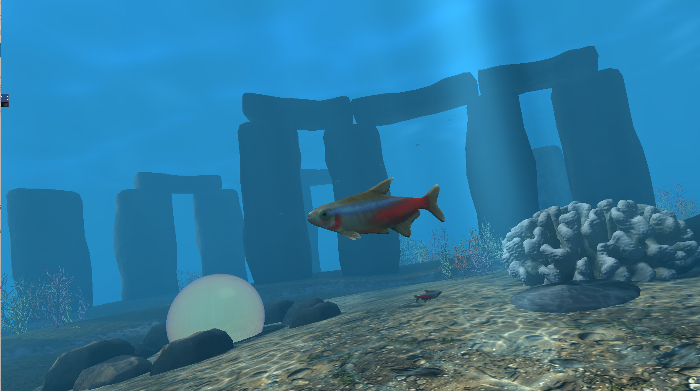
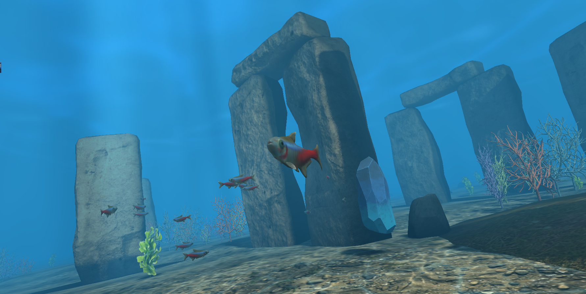
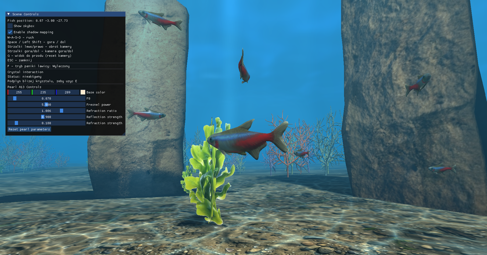
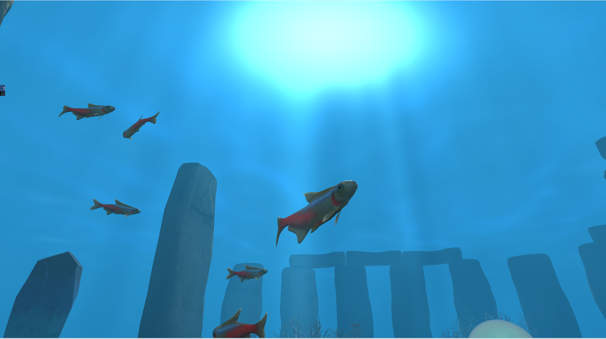

# Under Water World

## Skład grupy
- Ewelina Momot
- Paweł Cieśliński
- Piotr Codogni

## Wybrane metody A/B
Jako główne metody prezentowane w finalnej aplikacji wybraliśmy:
- **A13 Environment cubemap reflections/refractions**: Wykorzystanie tekstury otoczenia (cubemap) do obliczania realistycznych odbić i załamań na powierzchni szklistego kryształu (Perły). Parametry te można płynnie modyfikować w panelu UI.
- **B10 Depth fog**: Mieszanie koloru obiektów z kolorem środowiska (mgłą) zależnie od ich odległości od kamery, co symuluje naturalne zanikanie światła i widoczności w głębinach wodnych.

### Zrealizowane metody dodatkowe
Oprócz głównych metod zaimplementowano szereg innych, wzbogacających scenę:
- **A01 Volumetric light shafts** - symulacja widocznych smug światła (God rays) w wodzie.
- **A02 Caustics** - animowane wzory świetlne na dnie (kaustyka).
- **A10 Procedural vegetation/rocks** - proceduralnie rozkładana roślinność (np. algi, koralowce) i skały.
- **B05 Flocking/boids** - zaawansowane zachowanie ławicy ryb (pływanie po orbitach, tryb paniki i rozpraszania się).
- **B07 Heightmap seabed** - proceduralnie generowana siatka nierówności dna morskiego (góry i doły).
- **B09 OBJ model loading** - wczytywanie zewnętrznych modeli 3D (ryby, skały) z wykorzystaniem biblioteki Assimp.
- **B11 UI panel** - interaktywny panel kontrolny (ImGui) do modyfikacji parametrów sceny w czasie rzeczywistym.
- **B12 Transparency** - półprzezroczystość materiałów oraz wycinanie tła w roślinności morskiej (alpha discard i blending).

## Metody obowiązkowe
Projekt spełnia wszystkie wymagania obowiązkowe:
1. **Normal mapping**: Dodawanie detali powierzchni (m.in. na dnie, skałach, koralowcach) za pomocą map normalnych.
2. **PBR lighting**: Oświetlenie oparte na fizyce (współczynniki roughness i metallic) reagujące poprawnie na światło kierunkowe i ambient.
3. **Quaternion camera control**: Płynne sterowanie kamerą i obrotami z użyciem kwaternionów (uniknięcie Gimbal Lock).
4. **Shadow mapping**: Generowanie dynamicznych cieni rzucanych przez obiekty na dno z wykorzystaniem PCF (Percentage-Closer Filtering).
5. **PTF (Parallel Transport Frame)**: Obliczanie i aktualizowanie orientacji modeli (np. ryb wzdłuż ich ścieżek).
6. **Underwater skybox/cubemap**: Tekstura otoczenia dopasowana do środowiska podwodnego.

---

## Sterowanie
### Klawiatura i Mysz
- `W`, `A`, `S`, `D` - Poruszanie się rybki (przód, lewo, tył, prawo)
- `Space` - Ruch w górę
- `Left Shift` - Ruch w dół
- `Q` - Reset widoku kamery 
- `F` - **Tryb paniki ławicy ryb** (ryby dynamicznie rozpryskują się we wszystkich kierunkach, a ponowne wciśnięcie powoduje ich płynny powrót do ławicy)
- `E` - **Interakcja z kryształem** (zatrzymuje/wznawia obrót kryształu; wymaga podpłynięcia blisko obiektu)
- `Strzałki Lewo/Prawo` - Obrót kamery na boki 
- `Strzałki Góra/Dół` - Obrót kamery w pionie
- `ESC` - Zamknięcie aplikacji

### Panel UI (ImGui)
W lewym górnym rogu ekranu znajduje się panel **Scene Controls**, który pozwala na interakcję z systemami graficznymi na żywo:
- **Show skybox**: Checkbox włączający/wyłączający renderowanie podwodnego skyboxa w tle.
- **Enable shadow mapping**: Checkbox kontrolujący renderowanie cieni kierunkowych na dnie.
- **F - tryb paniki lawicy**: Status informujący czy panika jest obecnie `WŁĄCZONA` czy `WYŁĄCZONA`.
- **Crystal interaction**: Informacja o statusie kryształu (aktywny/nieaktywny) i podpowiedź czy jesteśmy wystarczająco blisko by użyć klawisza `E`.
- **Pearl A13 Controls**: Sekcja do demonstracji metody A13 na krysztale. Posiada suwaki kontrolujące w czasie rzeczywistym parametry PBR: `Base color`, `F0`, `Fresnel power`, `Refraction ratio`, `Reflection strength`, `Refraction strength`. Znajduje się tam również przycisk `Reset pearl parameters` do przywrócenia domyślnych wartości.

---

## Zrzuty ekranu





---

## Instalacja bibliotek

Projekt korzysta z bibliotek instalowanych przez `vcpkg`.

`vcpkg` to menedżer bibliotek C/C++, który pobiera wymagane biblioteki i automatycznie podłącza je do Visual Studio.

Wymagane biblioteki są zapisane w pliku:

```text
vcpkg.json
```

---

## Instalacja vcpkg

Otwórz PowerShell i wpisz:

```powershell
cd C:\Users\%USERNAME%\Desktop
git clone https://github.com/microsoft/vcpkg.git
cd vcpkg
.\bootstrap-vcpkg.bat
.\vcpkg.exe integrate install
```

Po wykonaniu tych komend `vcpkg` będzie zainstalowany i podłączony do Visual Studio.

---

## Ręczna instalcja bibliotek z vcpkg.json

Przejdź do głównego folderu projektu, czyli tam, gdzie znajduje się plik `vcpkg.json`:
Następnie uruchom:

```powershell
C:\Users\%USERNAME%\Desktop\vcpkg\vcpkg.exe install --triplet x64-windows
```

`vcpkg` odczyta plik `vcpkg.json` i pobierze wszystkie wymagane biblioteki.

---

## Automatyczna instalcja bibliotek
W projekcie powinny być włączone opcje:

```text
Use Vcpkg: Yes
Use Vcpkg Manifest: Yes
Install Vcpkg Dependencies: Yes
Use AutoLink: Yes
App-locally deploy DLLs: Yes
```
```text
Można je sprawdzić w:
Project Properties
→ Configuration Properties
→ vcpkg
```

---

## Uruchamianie projektu

Otwórz projekt przez plik:

```text
Computer-Graphic-Project.sln
```

W Visual Studio ustaw konfigurację:

```text
Debug | x64
```

 ---

## Struktura projektu

```text
Computer-Graphic-Project/
│
├── Computer-Graphic-Project.sln
├── vcpkg.json
├── README.md
├── screenshots/
│
└── Under-Water-World/
    ├── src/ i include/
    │   ├── core/
    │   ├── graphics/
    │   └── scene/
    │
    ├── shaders/
    └── assets/
        ├── models/
        ├── skybox/
        └── texture/
```

 ---

## Opis struktury i modułów

```text
Główne pliki projektu
- vcpkg.json: Konfiguracja menedżera pakietów vcpkg z listą wymaganych bibliotek C++.
- screenshots/: Folder przechowujący zrzuty ekranu wykorzystywane w pliku README.
- assets/: Zasoby ładujące się do pamięci na start aplikacji. Zawierają modele 3D (models/), tekstury sześcianu podwodnego (skybox/) oraz obrazy PBR (texture/).

Programy cieniujące (shaders/)
Katalog z programami GLSL uruchamianymi na GPU. Znajdują się tu shadery wyliczające oświetlenie PBR, proceduralne efekty (God Rays, mgła), zniekształcenia siatki (algi) i cieniowanie obiektów.

Zarządzanie aplikacją (core/)
Odpowiada za punkt wejścia do aplikacji. Zawiera główną pętlę zdarzeń, zarządzanie oknem (Window), wejście klawiatury/myszy (Input), obliczanie czasu klatek (Time) oraz sterowanie kamerą (Camera).

System graficzny (graphics/)
Logika komunikacji z OpenGL. Klasa Renderer zarządza głównym cyklem renderowania. Pozostałe klasy ładują programy cieniujące (Shader), wczytują modele przez Assimp (Model) oraz mapują tekstury na GPU (Texture, Cubemap).

Zarządzanie sceną (scene/)
Miejsce przetrzymywania wszystkich obiektów w podwodnym świecie. Klasa Scene generuje (często proceduralnie) i aktualizuje świat. W podfolderze entity/ znajduje się logika konkretnych obiektów, np. ławicy ryb z trybem paniki (FishSchool) czy szklistego kryształu (Pearl).
```

 ---
 
## Flow działania projektu

```text
Application::run()
    ↓
Time::update()
    ↓
Input::update()
    ↓
Application::processInput()
    ↓
Scene::update()
    ↓
Fish::update()
    ↓
Camera::followTarget()
    ↓
Renderer::beginFrame()
    ↓
Renderer::render(scene)
    ↓
Fish::render()
    ↓
Texture::bind()
    ↓
Model::draw()
    ↓s
ImGui render
    ↓
Window::swapBuffers()
    ↓
gotowa klatka na ekranie
```